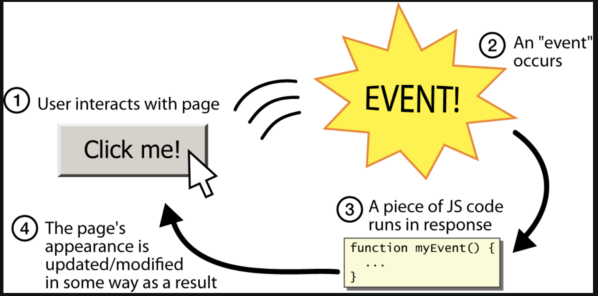
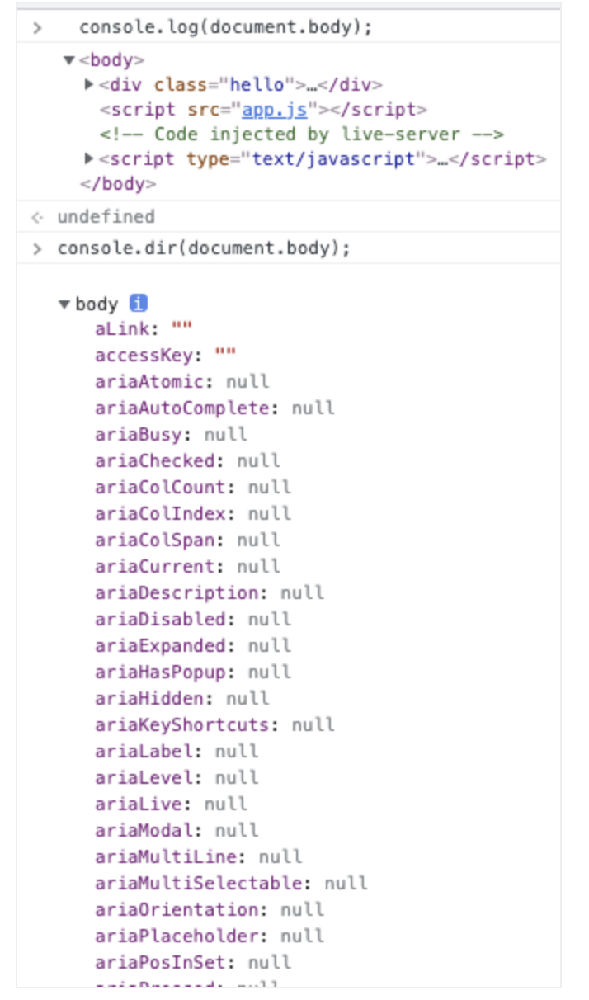

- Path에 대하여

    - ` context.beginPath() `: 다른 것을 그리고 싶을 때 path를 다르게 설정하여 마치 새로 그리는 것 처럼 보이도록 해줌

    - 이전에 그리던 경로와 단절되고 새로운 경로로 그림 그리는 것을 시작한다는 의미

        1. 선들을 먼저 그리고 포인트 A-B까지 선을 그려야함

        2. 그리고 fill(단색으로 다 채우는 것)할지 stroke(선만 보이는 것)할지 정해야 함

<br/>

< `context.moveTo()`, `context.lineTo()`에 대하여 >

`context.moveTo()`: 지정 좌표로 이동하는데 선을 그으면서 이동하지 않음

`context.lineTo()`: 지정 좌표로 이동하는데 선을 그으면서 이동함

---
<br/><br/><br/>

# 이벤트에 대하여



# `event`
- 어떤 사건을 의미한다
- 브라우저는 이벤트를 감지하고, 이벤트 발생 시 알려준다 -> 사용자 & 웹페이지 상호작용 가능

    ex) 버튼 클릭했을 '때', 입력했을 '때', 스크롤 했을 '때'.. 등등
<br/><br/>
# `event.target`
- 이벤트가 일어날 객체

    ex) 버튼 눌렀을 때, 새창이 열리는 이벤트면 `event.target`은 버튼
---
<br/><br/>
2022.07.16.

## `console.log`, `console.dir` 차이

`console.log`: html상의 태그요소를 console에 출력
`console.dir`: 태그의 모든 객체 정보를 볼 수 있도록 출력

<br/>



---

<br/>

---

# Arrow Function

    화살표 함수 표현(arrow function expression)은 전통적인 함수표현(function)의 간편한 대안입니다. 하지만, 화살표 함수는 몇 가지 제한점이 있고 모든 상황에 사용할 수는 없습니다.

- <u>this나 super</u> 에 대한 바인딩이 없고, <u>methods</u> 로 사용될 수 없습니다.

- <u>new.target</u>키워드가 없습니다.
- 일반적으로 스코프를 지정할 때 사용하는 call, apply, bind methods를 이용할 수 없습니다.
- <u>생성자(Constructor)로</u> 사용할 수 없습니다.
- yield를 화살표 함수 내부에서 사용할 수 없습니다.

## 기본구문
```javascript
(param1, param2, …, paramN) => { statements }
(param1, param2, …, paramN) => expression
// 다음과 동일함:  => { return expression; }

// 매개변수가 하나뿐인 경우 괄호는 선택사항:
(singleParam) => { statements }
singleParam => { statements }

// 매개변수가 없는 함수는 괄호가 필요:
() => { statements }
```

## 고급구문
```javascript
// 객체 리터럴 표현을 반환하기 위해서는 함수 본문(body)을 괄호 속에 넣음:
params => ({foo: bar})

// 나머지 매개변수 및 기본 매개변수를 지원함
(param1, param2, ...rest) => { statements }
(param1 = defaultValue1, param2, …, paramN = defaultValueN) => { statements }

// 매개변수 목록 내 구조분해할당도 지원됨
var f = ([a, b] = [1, 2], {x: c} = {x: a + b}) => a + b + c;
f();  // 6
```

## 짧은 함수

```javascript
var elements = [
  'Hydrogen',
  'Helium',
  'Lithium',
  'Beryllium'
];

// 이 문장은 배열을 반환함: [8, 6, 7, 9]
elements.map(function(element) {
  return element.length;
});

// 위의 일반적인 함수 표현은 아래 화살표 함수로 쓸 수 있다.
elements.map((element) => {
  return element.length;
}); // [8, 6, 7, 9]

// 파라미터가 하나만 있을 때는 주변 괄호를 생략할 수 있다.
elements.map(element => {
  return element.length;
}); // [8, 6, 7, 9]

// 화살표 함수의 유일한 문장이 'return'일 때 'return'과
// 중괄호({})를 생략할 수 있다.
elements.map(element => element.length); // [8, 6, 7, 9]

// 이 경우 length 속성만 필요하므로 destructuring 매개변수를 사용할 수 있다.
// 'length'는 우리가 얻고자 하는 속성에 해당하는 반면,
// lengthFooBArX'는 변경 가능한 변수의 이름일 뿐이므로
// 원하는 유효한 변수명으로 변경할 수 있다.
elements.map(({ length: lengthFooBArX }) => lengthFooBArX); // [8, 6, 7, 9]

// destructuring 파라미터 할당도 아래와 같이 작성할 수 있습니다.
// 이 예에서 정의한 객체내의 'length'에 값을 지정하지 않은 점에 주목하세요. 대신, "length" 변수의
// 리터럴 이름은 우리가 해당 객체에서 꺼내오고 싶은 속성이름 자체로 사용됩니다.
elements.map(({ length }) => length); // [8, 6, 7, 9] 
```

